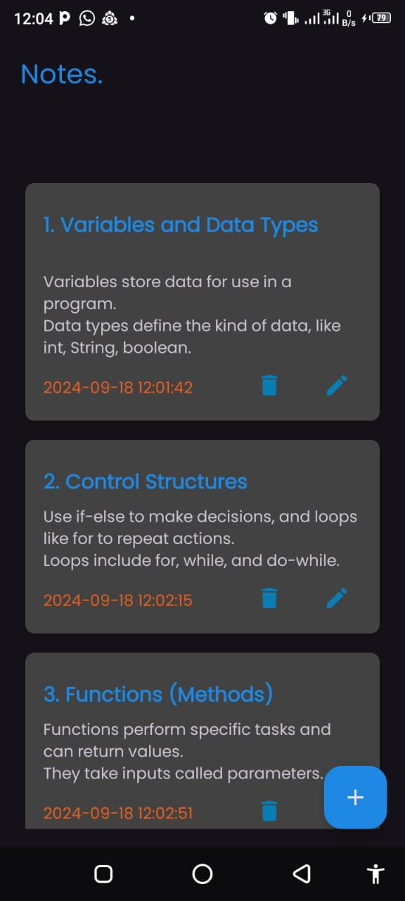
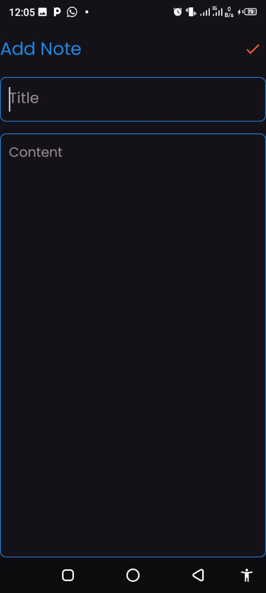

# Android Kotlin CRUD Notes App

A simple Android app built with Kotlin that allows users to create, read, update, and delete (CRUD) notes. This project demonstrates core Android development concepts including UI design, database management, and RecyclerView usage.

## Features

- **Create Notes:** Users can add a new note with a title and content.
- **View Notes:** All saved notes are displayed in a list format using a RecyclerView.
- **Update Notes:** Users can edit the title and content of an existing note.
- **Delete Notes:** Remove unwanted notes with a simple click.
- **SQLite Integration:** Local storage of notes using SQLite database.
- **Edge-to-Edge UI Support:** Optimized for modern Android UI with edge-to-edge support.
- **Clean and Simple UI:** Intuitive user interface design for better user experience.

## Technologies Used

- Kotlin
- Android SDK
- SQLite
- RecyclerView
## Screenshots

